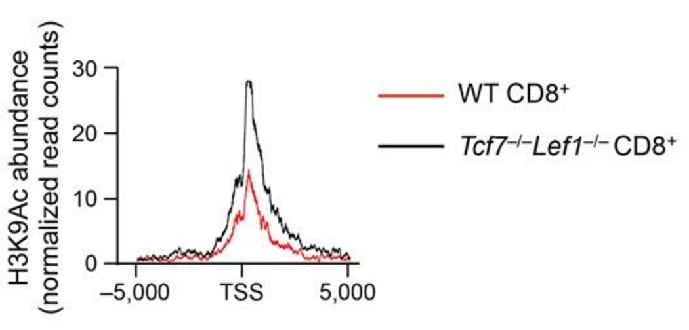
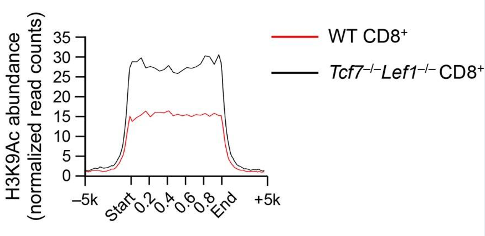
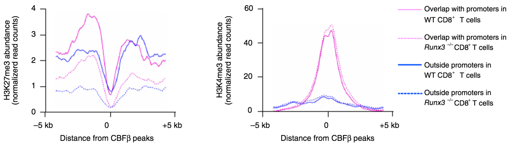
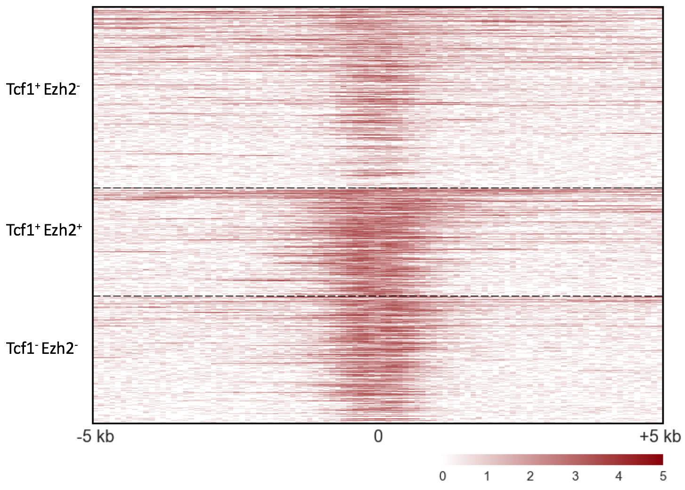

# bioinformatics-codebase
Collection of code for genomic data analysis (mainly for RNA-Seq and ChIP-Seq data)
## profile
Generating profile of histone marks at specific sets of genomic landmarks.

#### [`generate_profile_around_locations.py`](profile/generate_profile_around_locations.py)

**Usage:** generating profile around gene TSS or TES.

**Example:** from my co-first authored [paper](http://www.nature.com/ni/journal/v17/n6/full/ni.3456.html) published in *Nature Immunology* on 2016.



#### [`generate_profile_around_sites.py`](profile/generate_profile_around_sites.py)

**Usage:** generating profile around transcription binding sites.

**Example:** from my co-first authored [paper](http://www.nature.com/ni/journal/v17/n6/full/ni.3456.html) published in *Nature Immunology* on 2016.



#### [`generate_profile_around_summits.py`](profile/generate_profile_around_summits.py)

**Usage:** generating profile around transcription binding sites aligned by their summits.

**Example:** from my co-first authored [paper](http://www.nature.com/ni/journal/v18/n8/full/ni.3773.html) published in *Nature Immunology* on 2017.



#### [`generate_profile_matrix_around_summits.py`](profile/generate_profile_matrix_around_summits.py)

**Usage:** generating matrix of profiles around transcription binding sites. One profile for each binding site, organized as a heatmap.

**Example:** from my ongoing project



## enhancer
Finding enhancers from histone modification data.

#### [`find_enhancer.py`](enhancer/find_enhancer.py)

**Usage:** Identifying active, primed, poised enhancers from histone modification peaks.

**Dependencies:** `bedtools` needs to be pre-installed.

## genomic distribution
Obtaining the genomic distribution of peaks and their associated genes.

#### [`peaks_genomic_distribution.py`](genomic_distribution/peaks_genomic_distribution.py)

**Usage:** Counting the number of peaks located in different genomic region (promoter, gene body, and intergenic region).
if a peak is located in the promoter or gene body of a specific gene, record that associated gene.

**Example:**

stdout:

`Number of peaks in TSS region is 1920, number of peaks in promoter is 98, number of peaks in gene body is 425, and number of peaks in intergenic region is 335.`

output file:

```
chrom   start           end             genic_region
chr1    6204000         6205599         TSS_region Rb1cc1
chr1    7078600         7079899         TSS_region Pcmtd1
chr1    9737500         9738999         TSS_region 1700034P13Rik,TSS_region Vcpip1
chr1    16093900        16095699        TSS_region Rdh10,TSS_region Rpl7
chr1    16608700        16609699        TSS_region Ube2w
chr1    24685100        24686599        TSS_region Lmbrd1
chr1    31006300        31007299        TSS_region Ptp4a1,TSS_region Gm13363
chr1    34898600        34900599        TSS_region Fam168b
chr1    36322000        36323499        gene_body Neurl3
chr1    36364100        36367599        TSS_region Arid5a
chr1    36527900        36529499        TSS_region Cnnm4
```